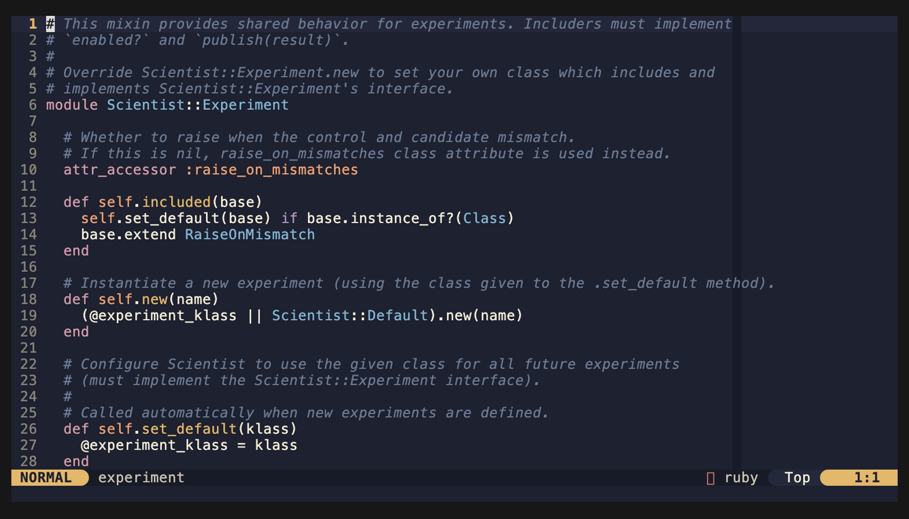
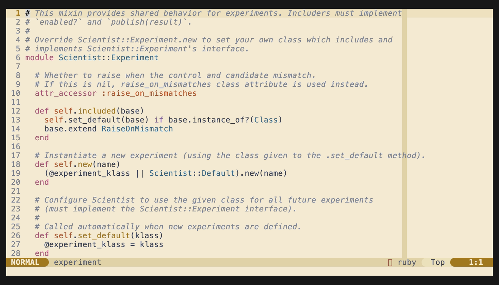
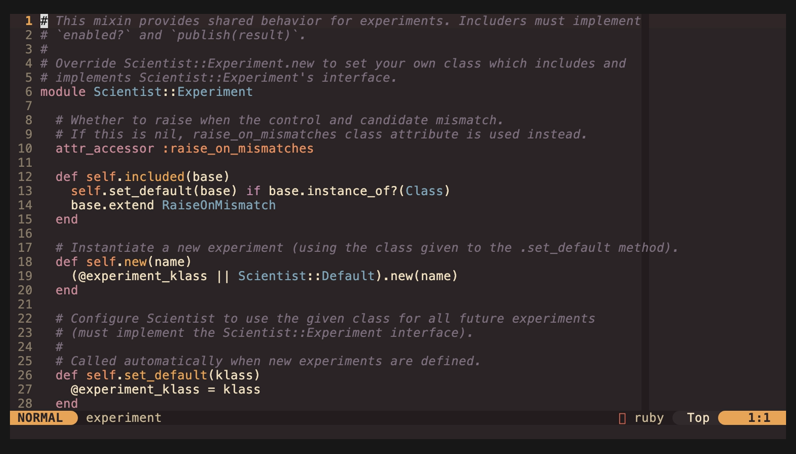
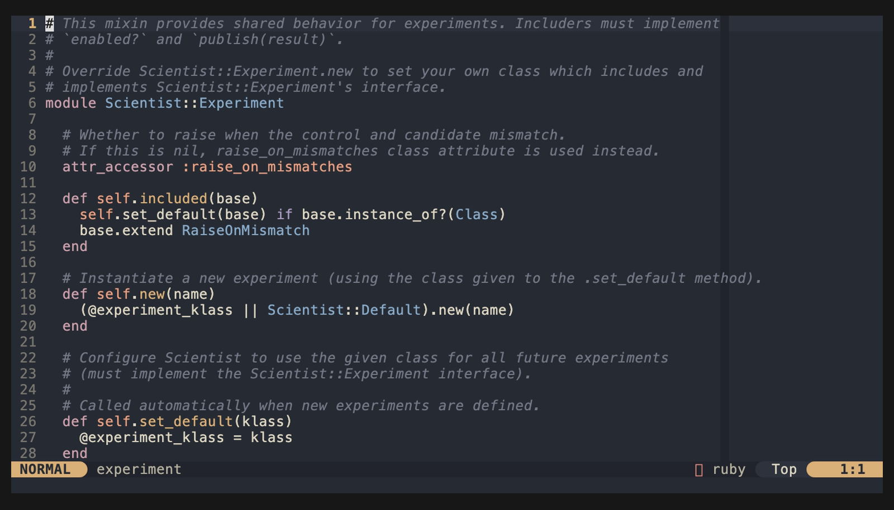

# metsanpeitto.nvim

A cozy, low-contrast Neovim colorscheme. Cream foreground on ink-blue
background, with woodblock-pastel accents. Designed to be easy on the
eyes for long sessions.

The name is the Finnish folklore concept of *metsänpeitto* -- the
forest's spell that hides wanderers in familiar woods. The romanization
drops the diaeresis to keep the name ASCII-clean.

## Inspirations

The palette distills the parts I liked most from a half-dozen schemes:

- **kanagawa-wave** -- deep ink-blue background, woodblock pastels
- **atomic** -- cream foreground (the signature element)
- **everforest** -- mossy strings and warm-earth restraint
- **juliana** -- slate comment tone, balanced UI chrome
- **nordfox** -- frost-blue discipline for types
- **lytmode** -- minimalist UI accents

## Variants

Four variants share the metsanpeitto identity but evoke different forest
moods.

|   |   |
| :---: | :---: |
|  <br> **tihea** — *"tiheä"* (dense) <br> Default dark; cool ink-blue, mossy <br> `:colorscheme metsanpeitto-tihea` |  <br> **aukea** — *"aukea"* (clearing) <br> Light; warm parchment, deeper accents <br> `:colorscheme metsanpeitto-aukea` |
|  <br> **syksy** — *"syksy"* (autumn) <br> Warm dark; autumn at twilight <br> `:colorscheme metsanpeitto-syksy` |  <br> **sumu** — *"sumu"* (fog) <br> Soft dark; desaturated, mist <br> `:colorscheme metsanpeitto-sumu` |

The bare `:colorscheme metsanpeitto` resolves a variant from
`vim.o.background` (`light` selects `aukea`, otherwise `tihea`). See
[`palette.md`](./palette.md) for the full color reference per variant.

## Requirements

- Neovim 0.9+
- A true-color terminal
- `termguicolors` enabled (the colorscheme sets this)

## Installation

Using `vim.pack` (Neovim 0.12+):

```lua
vim.pack.add({ 'https://github.com/fallwith/metsanpeitto.nvim' })
```

Using `lazy.nvim`:

```lua
{ 'fallwith/metsanpeitto.nvim', lazy = false, priority = 1000 }
```

Using `packer.nvim`:

```lua
use 'fallwith/metsanpeitto.nvim'
```

## Usage

Auto-resolve from `vim.o.background`:

```vim
:colorscheme metsanpeitto
```

Pick a specific variant:

```vim
:colorscheme metsanpeitto-syksy
```

Or in Lua:

```lua
vim.cmd.colorscheme('metsanpeitto-sumu')
```

## Configuration

Override the default variant resolution via `setup()`:

```lua
require('metsanpeitto').setup({
  variant = 'sumu', -- 'tihea' | 'aukea' | 'syksy' | 'sumu'
})
vim.cmd.colorscheme('metsanpeitto')
```

`setup()` is optional. If omitted, `:colorscheme metsanpeitto` falls back
to the `vim.o.background`-driven default. Specific-variant entry points
like `:colorscheme metsanpeitto-syksy` always select that variant
explicitly, ignoring `setup` config.

## Lualine

A `lualine.nvim` theme is included for each variant. The bare
`metsanpeitto` theme tracks whichever variant is currently active:

```lua
require('lualine').setup({
  options = { theme = 'metsanpeitto' },
})
```

To pin lualine to a specific variant regardless of the active colorscheme:

```lua
require('lualine').setup({
  options = { theme = 'metsanpeitto-sumu' },
})
```

## Palette

See [`palette.md`](./palette.md) for the full color reference, including
a side-by-side comparison of all four variants.

The currently active palette can be accessed at runtime:

```lua
local palette = require('metsanpeitto').palette()

-- or fetch a specific variant directly:
local syksy = require('metsanpeitto.palette').get('syksy')
```

Default tihea highlights:

- `#1d2230` ink-blue background
- `#f5ecd7` cream foreground
- `#a3bf83` mossy green strings
- `#b094c4` dusty violet keywords
- `#e5b86a` warm gold functions
- `#84b4d0` frost-blue types

## Supported plugins

Out-of-the-box highlight groups for:

- Tree-sitter (`@*`)
- LSP diagnostics, references, inlay hints
- gitsigns.nvim
- snacks.nvim (picker, dashboard, notifier)
- flash.nvim
- nvim-treesitter-context
- diffview.nvim
- oil.nvim

## Credits

The name riffs on the Finnish lineage that traces back to Tove Jansson
(the Moomins). Snufkin -- the wandering, free-spirited character --
would know *metsänpeitto* well.

## License

MIT. See [`LICENSE`](./LICENSE).
