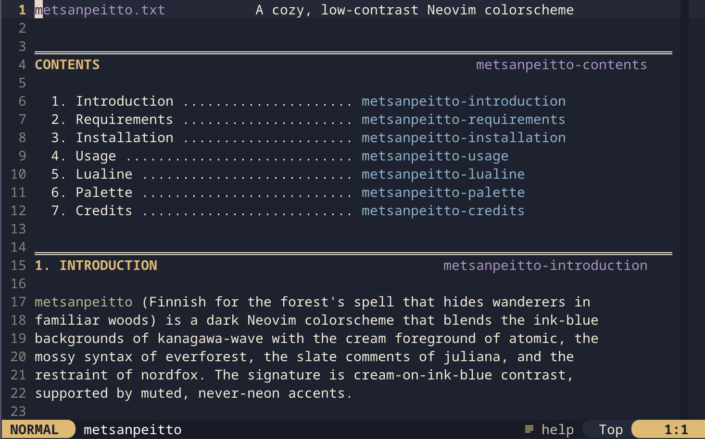

# metsanpeitto.nvim

A cozy, low-contrast Neovim colorscheme. Cream foreground on ink-blue
background, with woodblock-pastel accents. Designed to be easy on the
eyes for long sessions.



The name is the Finnish folklore concept of *metsänpeitto* -- the
forest's spell that hides wanderers in familiar woods. The romanization
drops the diaeresis to keep the name ASCII-clean.

## Inspirations

The palette distills the parts I liked most from a half-dozen schemes:

- **kanagawa-wave** -- deep ink-blue background, woodblock pastels
- **atomic** -- cream foreground (the signature element)
- **everforest** -- mossy strings and warm-earth restraint
- **juliana** -- slate comment tone, balanced UI chrome
- **nordfox** -- frost-blue discipline for types
- **lytmode** -- minimalist UI accents

## Requirements

- Neovim 0.9+
- A true-color terminal
- `termguicolors` enabled (the colorscheme sets this)

## Installation

Using `vim.pack` (Neovim 0.12+):

```lua
vim.pack.add({ 'https://github.com/fallwith/metsanpeitto.nvim' })
```

Using `lazy.nvim`:

```lua
{ 'fallwith/metsanpeitto.nvim', lazy = false, priority = 1000 }
```

Using `packer.nvim`:

```lua
use 'fallwith/metsanpeitto.nvim'
```

## Usage

```vim
:colorscheme metsanpeitto
```

Or in Lua:

```lua
vim.cmd.colorscheme('metsanpeitto')
```

Access the palette table for use elsewhere:

```lua
local palette = require('metsanpeitto').palette()
```

## Lualine

A `lualine.nvim` theme is included:

```lua
require('lualine').setup({
  options = { theme = 'metsanpeitto' },
})
```

## Palette

See [`palette.md`](./palette.md) for the full color reference.

Highlights:

- `#1d2230` ink-blue background
- `#f5ecd7` cream foreground
- `#a3bf83` mossy green strings
- `#b094c4` dusty violet keywords
- `#e5b86a` warm gold functions
- `#84b4d0` frost-blue types

## Supported plugins

Out-of-the-box highlight groups for:

- Tree-sitter (`@*`)
- LSP diagnostics, references, inlay hints
- gitsigns.nvim
- snacks.nvim (picker, dashboard, notifier)
- flash.nvim
- nvim-treesitter-context
- diffview.nvim
- oil.nvim

## Credits

The name riffs on the Finnish lineage that traces back to Tove Jansson
(the Moomins). Snufkin -- the wandering, free-spirited character --
would know *metsänpeitto* well.

## License

MIT. See [`LICENSE`](./LICENSE).
